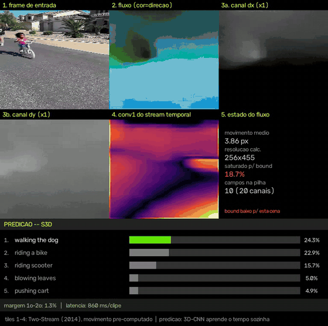

# Compreensão de vídeo


Painel didático que mostra, na mesma tela, **como** o reconhecimento de ação
funciona por dentro e **qual** ação está acontecendo.



*Tiles 1–4: o pipeline Two-Stream, frame a frame. Faixa inferior: a predição
do S3D em Kinetics-400, com a margem entre 1º e 2º lugar e a latência real.*

```powershell
# webcam
.venv\Scripts\python.exe analisar_video.py --source 0

# ou um arquivo de vídeo
.venv\Scripts\python.exe analisar_video.py --source meu_video.mp4
```

Tecla `q` encerra. Sem `--source`, usa a webcam.

---

## As duas metades

Uma CNN 2D olhando um frame isolado sabe dizer "há uma pessoa e uma bicicleta",
mas não distingue "pedalando" de "empurrando a bicicleta". Falta o movimento.
Duas gerações de arquiteturas resolveram isso de formas diferentes, e este
script mostra as duas juntas.

### 1. Two-Stream (Simonyan & Zisserman, 2014) — o mecanismo

O movimento entra **pré-computado**: um algoritmo clássico calcula o fluxo
óptico (para cada pixel, um vetor `dx,dy` dizendo para onde ele andou), e uma
pilha de K campos vira a entrada de uma segunda CNN.

```
frame RGB    -> stream ESPACIAL -> "o que aparece na cena"
fluxo óptico -> stream TEMPORAL -> "como as coisas se deslocam"
```

### 2. 3D-CNN / S3D (Kinetics-400) — a predição

O movimento é **aprendido** pela própria rede, com convoluções que se estendem
no eixo do tempo. Não usa fluxo óptico.

### O que está na tela

O fluxo óptico exibido **não alimenta** o modelo pré-treinado. São dois
caminhos paralelos sobre os mesmos frames:

```
frames --+--> fluxo óptico --> tiles 1..5  (o mecanismo, visível)
         |
         +--> clipe 16f     --> S3D        --> rótulo (a predição, real)
```

Isso não é limitação da implementação — é a diferença entre as arquiteturas.
Fingir que um alimenta o outro seria uma mentira didática.

**Por que não há checkpoint Two-Stream pré-treinado:** o torchvision só
distribui modelos de vídeo treinados em Kinetics-400, todos com arquitetura 3D.
Two-Stream é de 2014 e o campo migrou; não há pesos publicados nesse formato
que carreguem nesta implementação. Por isso o Two-Stream aparece como mecanismo
(correto e completo) e a predição vem do modelo moderno.

---

## O painel

| Tile | O que mostra |
|---|---|
| 1. frame de entrada | a fonte crua |
| 2. fluxo (cor=direção) | codificação HSV: matiz = direção, brilho = magnitude |
| 3a/3b. canais dx e dy | um dos 2K canais que entram na `conv1` temporal |
| 4. conv1 do stream temporal | mapa de energia dos 64 filtros reagindo ao fluxo |
| 5. estado do fluxo | movimento médio, resolução, saturação do `bound` |
| PREDIÇÃO | ranking top-K do modelo pré-treinado, margem e latência |

O tile 5 acende um aviso vermelho quando mais de 5% dos pixels saturam o
`--bound` — sinal de que o limite está baixo para a cena.

---

## Modelos

| `--model` | Top-1 Kinetics-400 | Custo/clipe (CPU) |
|---|---|---|
| `s3d` (padrão) | 68.4% | ~0.5 s |
| `r3d` | 63.2% | ~1.5 s |
| `mvit` | 80.8% | ~2.7 s |

Os três exigem clipes de exatamente 16 frames (fixo pela arquitetura).

---

## Opções principais

| Flag | Padrão | Para que serve |
|---|---|---|
| `--source` | `0` | índice da webcam ou caminho do vídeo |
| `--model` | `s3d` | qual rede pré-treinada usar |
| `--fps-limit` | `25` | cadência de exibição (`0` = o mais rápido possível) |
| `--stride` | `16` | 1 inferência a cada N frames |
| `--sample` | `2` | pega 1 frame a cada N para montar o clipe |
| `--bound` | `4.0` | clip do fluxo em pixels |
| `--stack` | `10` | K campos de fluxo (= 2K canais) |
| `--out` | — | grava o painel em vídeo |
| `--headless` | — | não abre janela (servidores sem display) |

---

## Notas de performance

A inferência custa ~530 ms em CPU, contra ~8 ms do resto do pipeline. Rodá-la
dentro do loop congelava o vídeo por meio segundo a cada disparo.

A solução foi mover a inferência para uma **thread separada**
(`InferenceWorker`). Medido em 150 frames:

| | antes | depois |
|---|---|---|
| pior frame | 555 ms | 28.6 ms |
| frames > 100 ms | ~9 | 0 |

Três decisões que valem registro:

- **Sem fila** — se um clipe novo chega com o worker ocupado, o anterior é
  descartado. Enfileirar só acumularia atraso; em vídeo ao vivo, resultado
  velho não interessa.
- **A GIL não atrapalha** — o trabalho pesado está dentro do PyTorch, que
  libera a GIL durante operações de tensor.
- **O rótulo fica alguns frames atrasado** em relação à imagem. Para leitura
  humana é imperceptível; o que incomodava era o congelamento.

Sem a inferência bloqueando, o loop passa a rodar mais rápido que a cadência
natural do vídeo — daí o `--fps-limit`.

---

## Detalhes de implementação

Quatro pontos que costumam sair errados em implementações de fluxo óptico:

1. **Cross-modality init** — a `conv1` do stream temporal herda os pesos RGB
   (média sobre os canais, replicada 2K vezes) em vez de ser reinicializada.
   Sem isso, o pré-treino ImageNet é desperdiçado exatamente na camada que mais
   se beneficia dele.
2. **Fluxo normalizado** — clip em `±bound` e reescala para `[-1, 1]`,
   replicando a quantização do dataset original.
3. **Reescala do vetor no resize** — bug silencioso: redimensionar o campo de
   fluxo move os pixels, mas **não** converte as magnitudes para a nova escala.
4. **Fluxo em baixa resolução + backend DIS** — ~10x mais rápido que Farneback
   em 480p, sem perda relevante para reconhecimento de ação.

Sobre o `--bound`: o paper usa 20 px, valor que pressupõe vídeo de alta
resolução. Em clipes 320x240 o deslocamento raramente passa de 2 px e um bound
alto joga todo o sinal para perto de zero — daí o padrão 4.0 aqui.

---

## Requisitos

Python ≥ 3.12, com `opencv-python`, `torch`, `torchvision` (ver
`pyproject.toml`). Os pesos são baixados automaticamente na primeira execução.

Vídeo de exemplo (pedestres, bom para ver o fluxo óptico):

```powershell
curl -L -o vtest.avi https://raw.githubusercontent.com/opencv/opencv/master/samples/data/vtest.avi
```

---

## Referências

- Simonyan & Zisserman, *Two-Stream Convolutional Networks for Action
  Recognition in Videos* (2014) — [arXiv:1406.2199](https://arxiv.org/abs/1406.2199)
- Wang et al., *Towards Good Practices for Very Deep Two-Stream ConvNets*
  (2015) — [arXiv:1507.02159](https://arxiv.org/abs/1507.02159)
- Xie et al., *Rethinking Spatiotemporal Feature Learning* (S3D, 2018) —
  [arXiv:1712.04851](https://arxiv.org/abs/1712.04851)

---

## Licença

MIT — ver [LICENSE](LICENSE).
