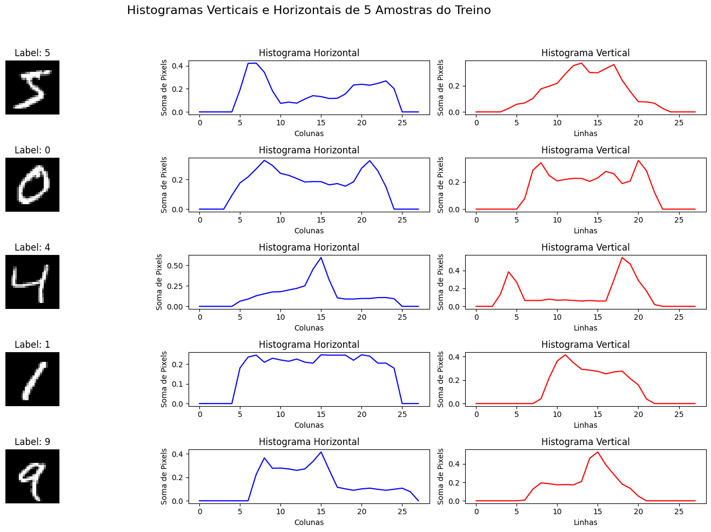

# Classificador de Dígitos MNIST Usando Histogramas

Este projeto implementa um classificador simples para o dataset **MNIST** (conjunto de dígitos manuscritos), utilizando histogramas horizontais e verticais como características. A classificação é baseada na distância euclidiana entre histogramas da imagem de teste e da base de treino.

## Objetivo
Classificar imagens de dígitos manuscritos do MNIST utilizando histogramas como método de comparação. A abordagem não utiliza redes neurais, focando em uma solução intuitiva baseada em estatísticas de pixel.

## Estrutura do Projeto
- **calculate_histograms**: Calcula os histogramas horizontal e vertical de uma imagem.
- **compare_histograms**: Calcula a distância euclidiana entre dois histogramas.
- **create_histogram_database**: Cria uma base de histogramas a partir das imagens de treino.
- **classify_image**: Classifica uma imagem de teste comparando seus histogramas com a base de histogramas.
- **Avaliação de Desempenho**: Mede a acurácia do classificador em um subconjunto do MNIST.

## Requisitos
As seguintes bibliotecas são necessárias:

```bash
pip install numpy matplotlib opencv-python-headless scikit-learn
```

## Uso
### 1. Configurar o ambiente
Clone o repositório e instale os pacotes necessários:

```bash
git clone <URL_DO_REPOSITORIO>
cd <NOME_DO_DIRETORIO>
pip install -r requirements.txt
```

### 2. Executar o script
O código pode ser executado diretamente em um ambiente Python. Ele realiza as seguintes etapas:
1. Carrega um subconjunto do dataset MNIST.
2. Gera uma base de histogramas com as imagens de treino.
3. Classifica uma imagem aleatória e exibe os resultados:
   - Imagem de teste.
   - Histogramas horizontais e verticais.
4. Avalia a acurácia no subconjunto de teste.

### 3. Resultado Esperado
O programa exibirá gráficos comparando histogramas e mostrará a acurácia do classificador:

```plaintext
Acurácia do classificador baseado em histogramas: 84.00%
```

### 4. Exemplos


## Dataset
O dataset MNIST é carregado através do módulo `sklearn.datasets`.

## Contribuições
Contribuições são bem-vindas! Se tiver melhorias ou correções, abra uma issue ou pull request.

## Licença
Este projeto está licenciado sob a MIT License.
